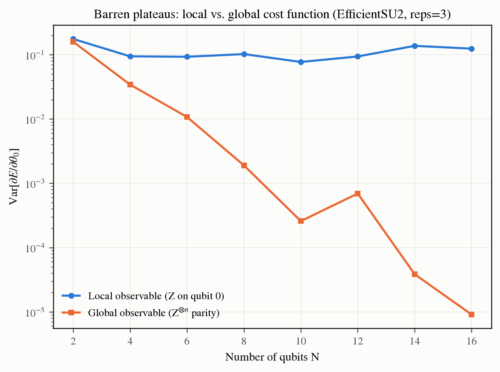
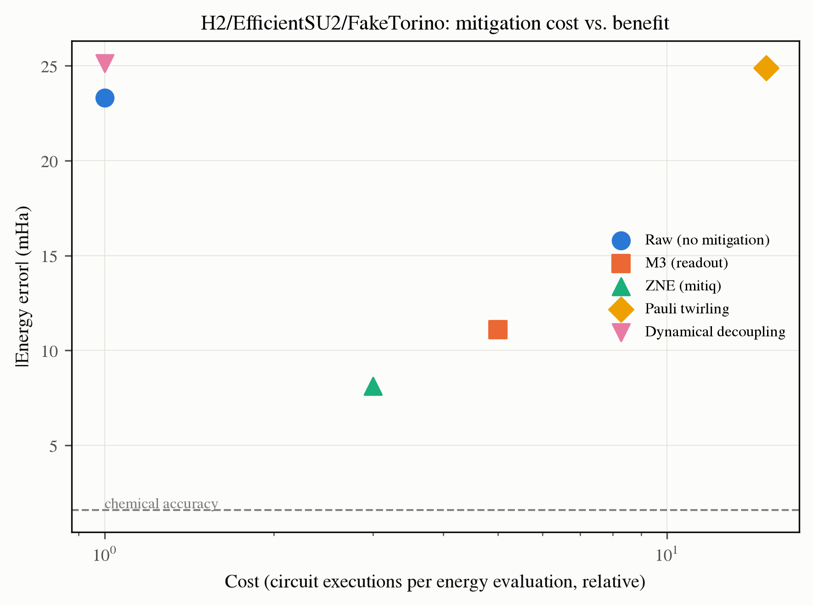
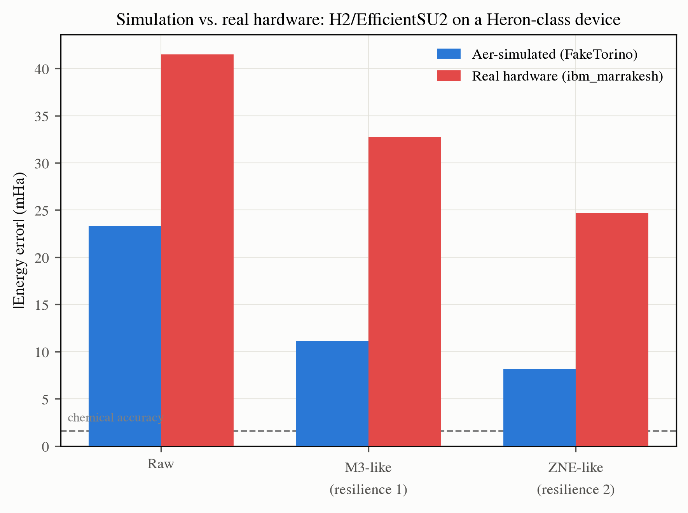
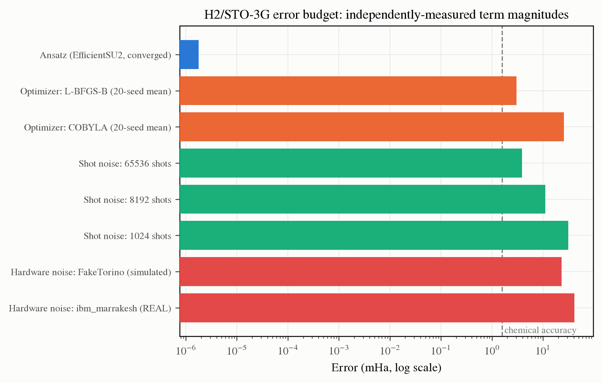

# Findings

A number-by-number walkthrough of this project's results, phase by phase. Every figure
and number here is reproduced directly from a script in `scripts/` or a test in
`tests/` — nothing is hand-tuned for presentation. The full derivations and discussion
are in the [technical report](https://github.com/tunatyurkoglu13/Variational-Quantum-Eigensolver/blob/main/report/main.pdf).

## Hamiltonian construction and mappings

H2, LiH, and BeH2 in a minimal STO-3G basis. Qiskit Nature and
OpenFermion Hamiltonians, built independently from the same molecular-orbital integrals,
agree in eigenspectrum to 4.4×10⁻¹⁶ Ha (machine precision) once three library-convention
mismatches are reconciled (a missing nuclear-repulsion constant, blocked-vs-interleaved
spin-orbital ordering, and OpenFermion's two-body integral index convention).

General Z₂-symmetry qubit tapering removes 3, 4, and 5 qubits for H2, LiH, and
BeH2 respectively — not the textbook "always 2" — taking H2 down to
a single qubit. Tapering's effect on measurement-group count (shot cost) is *not*
uniformly favorable: it improves for H2 (15→5 groups) and LiH (58→38) but
**worsens** for BeH2 (53→56), reported as measured rather than smoothed into a
"tapering always helps" narrative.

## Ansatz comparison

On H2: UCCSD (3 parameters) reaches FCI with expressibility
DKL = 3.51 ± 0.10 (Monte Carlo estimate, 5 seeds × 5000 samples); EfficientSU2
(24 parameters) is roughly 3 orders of magnitude more Haar-random-like
(DKL = 0.0049 ± 0.0008). ADAPT-VQE reaches FCI with a **single** parameter,
correctly skipping both single excitations — an empirical reproduction of Brillouin's
theorem.

## Barren plateaus

Reproducing Cerezo et al. 2021's local-vs-global result on the same shallow EfficientSU2
family: a global observable's gradient variance decays four orders of magnitude
(0.16 → 9×10⁻⁶) from N=2 to N=16 qubits, while a local observable's stays flat.

## Error mitigation under simulated noise

Four techniques implemented from their primary sources, compared on the same
H2/EfficientSU2 circuit under a real device's calibrated noise model. M3 and
ZNE show large, reliable benefit; Pauli twirling and dynamical decoupling show
negligible benefit **for a mechanistically-understood reason** — the noise model's
channels are already near-Pauli-diagonal / purely memoryless, i.e. missing exactly the
structure those two techniques are designed to remove.

## Real hardware validation — the headline result

The same circuit, run for real on IBM's `ibm_marrakesh` (Heron r2). Every real-hardware
error is 1.5-3× **larger** than the corresponding simulated prediction:

To rule out "stale calibration data" as the explanation, a fresh noise model was built
from `ibm_marrakesh`'s own *live* calibration snapshot and simulated at zero hardware
cost: predicted error 12.7 mHa — smaller, not larger, than the older snapshot's
prediction, and still less than a third of the real 41.5 mHa result. The gap is
methodological: standard noisy-simulation construction (depolarizing + thermal
relaxation) omits coherent-noise structure real hardware has, regardless of whose
calibration numbers are used.

## Error budget

Decomposing the gap to chemical accuracy on H2 into four independently-measured
terms:

Ansatz choice is not a meaningful bottleneck once the optimizer converges; shot noise and
optimizer reliability contribute comparable, controllable amounts; hardware noise
dominates by a wide margin — and the real device's contribution is itself larger than
this project's best simulated prediction of it.
